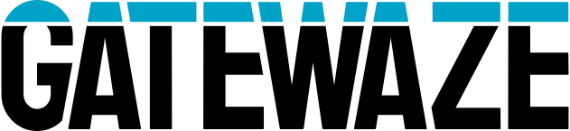

  <picture>
    <source media="(prefers-color-scheme: dark)" srcset="assets/gatewaze-logo-white.svg">
    <source media="(prefers-color-scheme: light)" srcset="assets/gatewaze-logo-black.svg">
    
  </picture>

  <strong>The AI-native open-source platform for communities</strong>

  Members, events, content, and communications, plus the AI to run them.

  <a href="https://github.com/gatewaze/gatewaze">Platform</a> |
  <a href="https://github.com/gatewaze/gatewaze-modules">Modules</a> |
  <a href="https://opensource.org/licenses/Apache-2.0">License</a>

Gatewaze is a modular, open-source platform for managing communities and the people in them. You assemble it from modules: turn on the pre-built ones for members, events, content, newsletters, sites, and communications, and build your own for anything specific to how your community works.

**Proven in production.** Gatewaze runs a developer community of 155k+ members, with 58k+ newsletter subscribers and 76k+ meetup attendees.

## A platform you assemble from modules

Every capability in Gatewaze is a module, and a module is a self-contained mini-application. It can bring its own admin UI, API routes, background jobs, database migrations, and public-facing portal pages, with no separate frontend to build. Turn on the modules you want, disable the ones you don't, and write new ones when the catalog doesn't cover your use case.

- **76 pre-built modules** covering events, members, content, newsletters, sites, marketing, communications, integrations, and platform infrastructure.
- **Build a module for anything.** Scaffold one from the template, add your tables, admin pages, API routes, and portal, and the platform discovers and runs it automatically.
- **A public portal, out of the box.** A module ships its own portal pages, so a new feature is live for your members the moment it is enabled.

## Run AI in production, in-house

AI is built in, so you can ship AI features on your own infrastructure without a separate AI platform. Custom AI use cases are themselves just modules.

- **One provider router**: OpenAI, Anthropic, and Google Gemini behind a single interface, with per-user and per-use-case credentials and model allow-lists.
- **Bring your own agent**: author a [Goose](https://github.com/aaif-goose/goose) recipe locally and run it unchanged in production. Gatewaze runs Goose, Block's open-source agent runtime, as a server-side CLI, so there is no rewrite and no local-to-cloud translation. The recipe that works on your laptop is the one that runs in prod.
- **MCP server library**: expose your platform to agents through bundled [Model Context Protocol](https://modelcontextprotocol.io) (MCP) servers, including platform data (events, speakers, sponsors, health), a whitelisted API proxy, and a headless browser (local Chromium or [Browserbase](https://www.browserbase.com)).
- **Agent memory that compounds**: agents keep a durable, git-synced knowledge base based on [Andrej Karpathy's LLM Wiki](https://gist.github.com/karpathy/442a6bf555914893e9891c11519de94f) design, distilling immutable raw sources into LLM-authored, cross-linked wiki pages with full-text and vector search.
- **AI chat and custom use cases**: drop in a streamed chat widget, or build a module for any AI use case, such as an automated daily briefing, content triage, or attendee matching, each with its own credentials, tools, and budget.
- **Governance and cost control**: encrypted credentials, model and tool allow-lists, a per-call usage ledger, and hard budget caps that keep AI spend predictable.

## Built for automation

A headless browser for agents, a governed web-fetch API (quotas, domain rules, robots.txt, audit and billing), and a scraper system backed by a fetch service built on [Scrapling](https://github.com/D4Vinci/Scrapling), with eight swappable residential-proxy providers.

## Own your whole stack

Self-host everything, including the AI. Gatewaze runs on a stack you already know: [Supabase](https://supabase.com) for Postgres, Auth, Storage, and Edge Functions; [Redis](https://redis.io) with [BullMQ](https://bullmq.io) for background jobs and workers; and [Umami](https://umami.is) for first-party, self-hosted analytics. Start in minutes with Docker Compose, then run it in production on Kubernetes with the bundled Helm chart. No SaaS lock-in, and no data leaves your cluster.

## Getting Started

- Start with the core platform: [gatewaze/gatewaze](https://github.com/gatewaze/gatewaze)
- Browse the 76-module open-source collection: [gatewaze/gatewaze-modules](https://github.com/gatewaze/gatewaze-modules)
- Build your own modules with the Module System Guide in the core repository

## Project Structure

- [gatewaze](https://github.com/gatewaze/gatewaze): Core platform. Member management, admin app, public portal, API, AI runtime, and the module system.
- [gatewaze-modules](https://github.com/gatewaze/gatewaze-modules): Official open-source module collection (Apache-2.0), covering events, content, sites, marketing, communications, integrations, AI, and platform infrastructure.
- [gatewaze-template-site](https://github.com/gatewaze/gatewaze-template-site): Next.js boilerplate for Gatewaze sites (default theme).
- [gatewaze-template-email](https://github.com/gatewaze/gatewaze-template-email): HTML email boilerplate for newsletter modules.
- [gatewaze-template-blocks](https://github.com/gatewaze/gatewaze-template-blocks): Starter block library for website-kind sites.
- [gatewaze-skills](https://github.com/gatewaze/gatewaze-skills): Reusable developer skills for building and maintaining the platform.

## Contributing

We welcome contributions of all kinds: bug fixes, documentation, new modules, and feature proposals. Each repository includes a contributing guide, and most ask you to sign a Contributor License Agreement before your first pull request is merged.

## About

Gatewaze is an open source project hosted by [The Linux Foundation](https://lfprojects.org) and open to contributions from the entire community.
